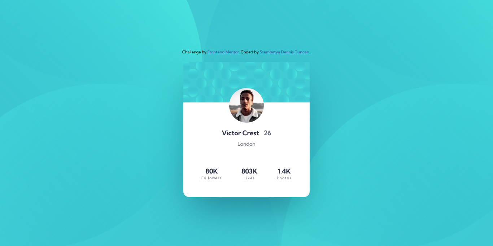

# Frontend Mentor - Profile card component solution

This is a solution to the [Profile card component challenge on Frontend Mentor](https://www.frontendmentor.io/challenges/profile-card-component-cfArpWshJ). Frontend Mentor challenges help you improve your coding skills by building realistic projects.

### The challenge

- Build out the project to the designs provided

### Screenshot

### Links

- Solution URL: [Profile card component challenge on Frontend Mentor](https://www.frontendmentor.io/solutions/responsive-profile-card-component-with-css-flexbox-rLNR4M-9XI)
- Live Site URL: [Profile card component challenge #live site](https://profile-card-component-kohl-zeta.vercel.app/)

### Built with

- Semantic HTML5 markup
- CSS
- Flexbox

### What I learned

In the Profile card component challenge on Frontend Mentor challenge I managed to learn away to display two background images in different positions.

## Author

- Frontend Mentor - [@ssembatya-dennis](https://www.frontendmentor.io/profile/ssembatya-dennis)
- Twitter - [@DennisSsembatya](https://twitter.com/DennisSsembatya)
